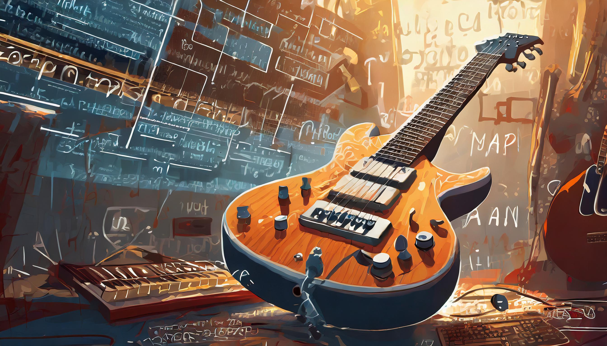

# Neuraliti
## Introduction
Welcome to Neuraliti, an open-source project aimed at providing a platform for audio synthesis enthusiasts to explore, experiment, and create music and sound in a collaborative environment. Whether you're a seasoned developer, a sound designer, or just curious about the world of audio synthesis, we invite you to join us on this journey of exploration and creativity.

## Overview
Neuraliti is a Git repository dedicated to the development of audio synthesis tools, libraries, and applications. It offers a range of features and functionalities to facilitate the creation and manipulation of digital audio signals, enabling users to generate a wide variety of sounds, from simple tones to complex textures.

## Usage
1. Clone the repository or download as .zip file.
2. Launch
   ```shell
   ./bin/GENT
   ```

## Collaborating
Please feel free to send an Email if you would like to make contributions to this project.
## Roadmap
### Phase 1: Foundation (Current)</br>
* Set up GitHub repository with version control.
* Define project structure, coding standards, and documentation guidelines.
* Simple Building block externals.
* Implement collection of Math functions
### Phase 2: Expansion (Next 6 Months)
* Intigrate advanced methods for signal processing and effects.
* Explore possibilites of AI and LLM for audio syntheesis
### Phase 3: Integration (Next 12 Months)
* Ensure compatibility for industry standard DAWs
### Phase 4: Community Growth (Next 18 Months)
* Encourage contribution and feedback from the community through open discussions and feature requests.
